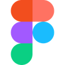
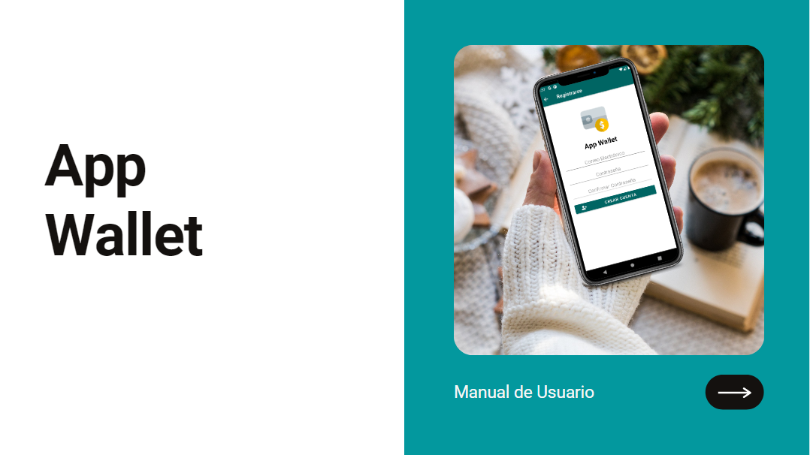
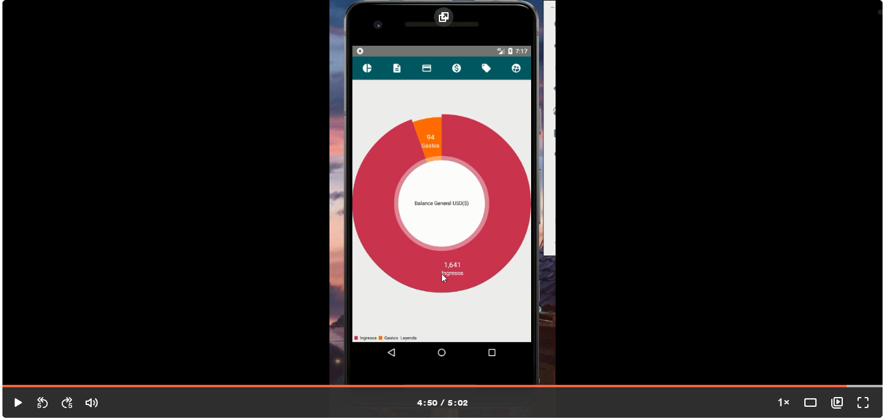

# App Wallet #


Crear una aplicación para llevar el registro de gastos e ingresos que puede tener una
persona natural a lo largo de la semana, clasificando según sus tipos de gastos para que
se puedan crear gráficas que muestren el uso de los ingresos del usuario y los
destinatarios de los mismos.

## Descripción ##

El problema se centra en las personas que no conllevan un orden financiero en sus
cuentas y gastos, con la aplicación se resuelve el desorden del usuario y organiza sus
cuentas y documenta todas las transacciones realizadas por el usuario teniendo un
control más detallado con reportes y gráficos estadísticos.

## Dependencias ##

------
```
dependencies {
    ...
    implementation 'androidx.appcompat:appcompat:1.2.0'
    implementation 'com.google.android.material:material:1.3.0'
    implementation 'androidx.constraintlayout:constraintlayout:2.0.4'
    implementation 'com.google.firebase:firebase-auth:20.0.3'
    implementation 'com.google.android.gms:play-services-auth:19.0.0'
    implementation 'androidx.legacy:legacy-support-v4:1.0.0'

    //add new implementation
    implementation 'androidx.recyclerview:recyclerview:1.1.0'
    implementation 'com.squareup.picasso:picasso:2.71828'
    implementation 'com.firebaseui:firebase-ui-firestore:7.1.1'
    implementation 'com.google.firebase:firebase-firestore:22.1.2'
    implementation 'com.github.PhilJay:MPAndroidChart:v3.1.0'

}
```

## Trello ##


El siguiente enlace se muestra el tablero de trabajo del equipo [aquí](https://trello.com/b/P9p4y21S/dsm-project)

## Mockups de la aplicación - Figma ##




El siguiente enlace se muestra el tablero de trabajo del equipo [aquí](https://www.figma.com/file/xuDpHcuVH9y9lEAsUU3w8h/DSM---App)

## Manual de Usuario ##



El siguiente enlace se muestra el manual de usuario para la aplicación [aquí](https://www.canva.com/design/DAEb8KekGOs/fTcI0X83R-guQIrN6dq3Kg/view?utm_content=DAEb8KekGOs&utm_campaign=designshare&utm_medium=link&utm_source=sharebutton)

## Manual Técnico ##


El siguiente enlace se muestra el manual técnico de la aplicación [aquí](https://drive.google.com/file/d/1UrY26_md67VTc3uZ_STVp7ILMiFrSbeP/view?usp=sharing)

## Funcionamiento - Loom ##


[](https://www.loom.com/share/40cfd472696e4acb8b374fe806893d07)

## Descarga de APK ##

[](https://drive.google.com/file/d/1L-Al2lXhytDcyxiffLwuJFv5D80-W6u5/view?usp=sharing)


## Desarrolladores ##

* Mario Josué Beltrán                       BG171969  -  T01
* Andrés Eduardo Molina Moz                 MM161405  -  T01
* José Eduardo Díaz Erazo                   DE161905  -  T01
* Patricia Guadalupe Quintanilla Rodríguez  QR140595  -  T01

## Licencias Creative Commons ##


CC-BY-NC: permite distribuir y hacer cambios en la obra siempre y cuando se incluya el
nombre del autor y la licencia. Sin embargo, no se permite su uso con fines comerciales.

## Otras Licencias ##

-------

    Copyright 2014 - 2020 Henning Dodenhof

    Licensed under the Apache License, Version 2.0 (the "License");
    you may not use this file except in compliance with the License.
    You may obtain a copy of the License at

        http://www.apache.org/licenses/LICENSE-2.0

    Unless required by applicable law or agreed to in writing, software
    distributed under the License is distributed on an "AS IS" BASIS,
    WITHOUT WARRANTIES OR CONDITIONS OF ANY KIND, either express or implied.
    See the License for the specific language governing permissions and
    limitations under the License.


SHA1: 03:41:DD:3A:B4:16:8C:A6:CC:6C:1A:8F:14:C1:B3:84:D3:FB:60:B2
SHA-256: E5:9C:EB:34:C1:1E:C0:E4:8F:34:4B:3B:88:20:B3:4F:9F:90:9D:82:AE:66:8F:5A:07:26:10:7F:E4:A4:DB:5B
